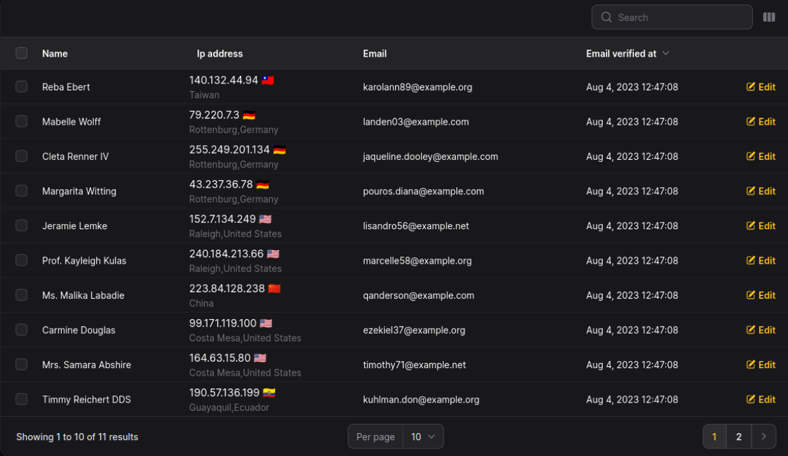

# IP to country flag Column for Filament 🚩


[](https://packagist.org/packages/mohammadhprp/filament-ip-to-country-flag-column)
[](https://packagist.org/packages/mohammadhprp/filament-ip-to-country-flag-column)

Display country flag from IP address in your Filament tables

> **Warning**
> This plugin may cause a slight delay in page loading due to API calls to [iplocation](https://iplocation.com).

## Screenshot



## Installation

You can install the package via composer:
```bash
composer require mohammadhprp/filament-ip-to-country-flag-column
```

## Usage

```php
use Mohammadhprp\IPToCountryFlagColumn\Columns\IPToCountryFlagColumn;

IPToCountryFlagColumn::make('client_ip')
```

## Changelog

Please see [CHANGELOG](CHANGELOG.md) for more information on what has changed recently.

## Contributing

1. Fork the repository.
2. Create a new branch for your feature.
3. Make your changes and commit them with clear commit messages.
4. Submit a pull request to the `master` branch.

## Credits

- [Mohammadhprp](https://github.com/mohammadhprp)
- [All Contributors](https://github.com/mohammadhprp/filament-ip-to-country-flag-column/contributors)

## License

This project is licensed under the MIT License - see the [License](LICENSE) file for details.
